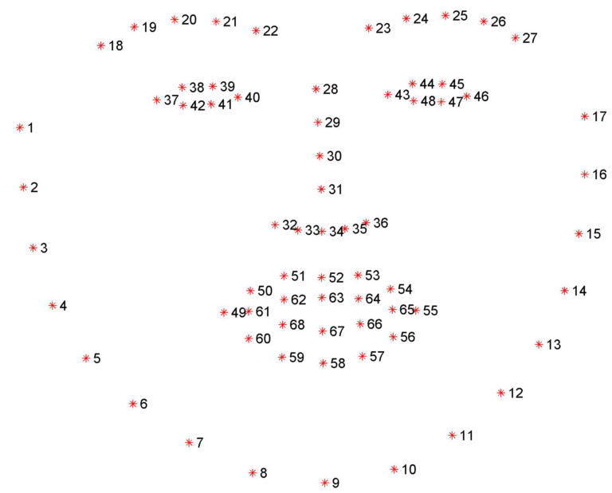
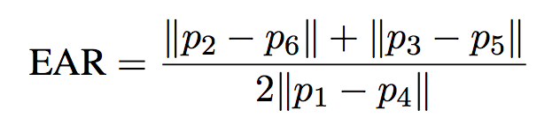
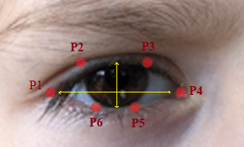

# drowsiness-detection
A simple project that constantly monitors the driver and plays an alert sound to wake the driver up if he/she is drowsy.

# Dependencies :
1. opencv
2. scipy
3. dlib
4. sounddevice
5. soundfile
6. numpy

# Working :
Using the dlib library, we can find the facial landmarks such as eyes, nose, ears, mouth,etc as illustrated in the below figure.



A shape detector is required as well, which is provided in the repo.
Referring to the paper [Real-Time Eye Blink Detection using Facial Landmarks, Tereza Soukupova and Jan Cech,(2016)](http://vision.fe.uni-lj.si/cvww2016/proceedings/papers/05.pdf), **Eye Aspect Ratio(EAR)** is given by the following formula :



where, p1,...,p6 are as shown below :


The coordinates for each landmark point can be found using the part number as listed in the Facial Landmarks picture above, which is then used to compute the Eye Aspect Ratio.

The authors of the above referred paper suggest to take the average of EAR of both eyes. A threshold is set for the EAR below which the driver is said to be drowsy. If the driver is 'drowsy' for 30 consecutive frames, a loud alarm sound is played in order to wake the driver up.

# Usage
To run the program, simply type the following command :
 ```
 python3 Drownsiness_Detection.py
```
# Applications
Can be implemented on a microcontroller(after optimizing the code) and used in cars to sound an alarm if the driver is found to be drowsy.
# References
[Real-Time Eye Blink Detection using Facial Landmarks, Tereza Soukupova and Jan Cech,(2016)](http://vision.fe.uni-lj.si/cvww2016/proceedings/papers/05.pdf)
